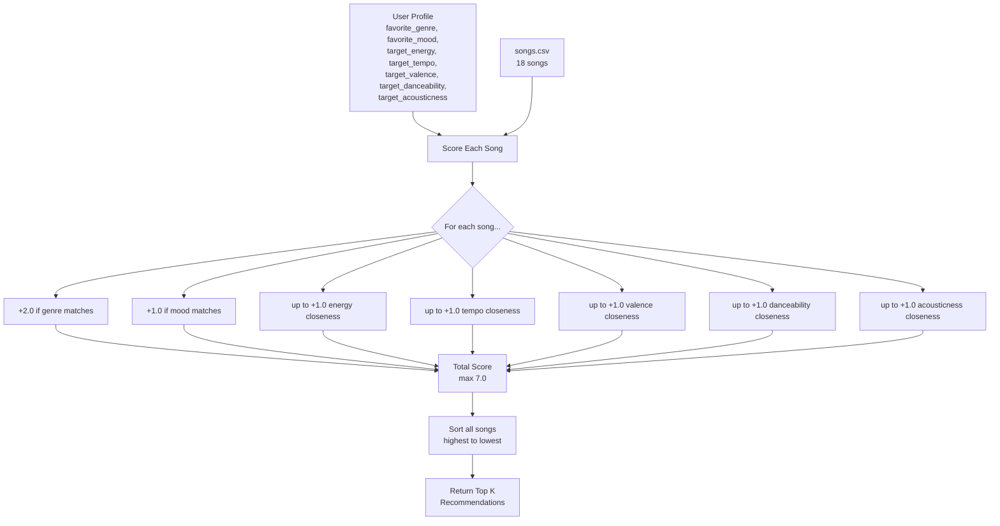

# 🎵 Music Recommender Simulation

## Project Summary

This simulation builds a content-based music recommender in Python that scores songs from a small catalog against a user's taste profile. It awards points for matching genre and mood, and uses a proximity formula to reward songs whose numerical features (energy, tempo, valence, danceability, acousticness) are closest to the user's targets. The top K songs by total score are returned as personalized recommendations.
---

## How The System Works


Real-world platforms like Spotify use a mix of collaborative filtering (recommending based on what similar users liked) and content-based filtering (recommending based on a song's own attributes like genre, mood, and energy). This simulation focuses purely on content-based filtering -- it compares song attributes directly to a user's stated preferences, with no behavioral data involved.


Algorthm Recipe: 
Each song is scored by comparing its attributes to the user's target profile. Genre match awards +2.0 points and mood match awards +1.0 because categorical matches are the strongest signal of taste. The five numerical features (energy, tempo, valence, danceability, acousticness) each contribute up to +1.0 using a proximity formula that rewards closeness to the user's target value. The maximum possible score is 7.0. Songs are then sorted from highest to lowest score and the top K results are returned.




Expected bias: this system will strongly favor lofi songs for the default profile because genre is worth more than any single numerical feature. A great match on all five numerical features (5.0 points) still loses to any song that matches genre and mood (3.0 points plus some numerical score).


Song features: genre, mood, energy, tempo_bpm, valence, danceability, acousticness

User profile stores: favorite_genre favorite_mood, target_energy,  target_tempo_bpm, target_valence, target_danceability, target_acousticness

Scoring weights: genre match (+2.0), mood match (+1.0), energy closeness (up to +1.0)

---

## Getting Started

### Setup

1. Create a virtual environment (optional but recommended):

   ```bash
   python -m venv .venv
   source .venv/bin/activate      # Mac or Linux
   .venv\Scripts\activate         # Windows

2. Install dependencies

```bash
pip install -r requirements.txt
```

3. Run the app:

```bash
python -m src.main
```

### Running Tests

Run the starter tests with:

```bash
pytest
```

You can add more tests in `tests/test_recommender.py`.

---

## Experiments You Tried

Experiment 1 -- Four diverse profiles
The lofi and pop profiles returned strong varied results because those genres have more songs in the catalog. The rock and blues profiles showed a sharp drop after the first result, revealing that underrepresented genres get weaker recommendations overall.


```
Loaded songs: 18

Top recommendations:

Library Rain by Paper Lanterns
Score: 7.86
Because: genre match (+2.0), mood match (+1.0), energy closeness (+0.97)...

Midnight Coding by LoRoom
Score: 7.82
...
```
---

## Limitations and Risks

The catalog is small (18 songs), so results will feel repetitive across different profiles
Genre carries the most weight, which means a great mood and energy match can still lose to a mediocre genre match

The system has no memory -- it treats every session as if the user is brand new
It cannot understand lyrics, language, or cultural context

The dataset skews toward pop and lofi, so users with other tastes will get fewer strong matches

---

## Reflection

Read and complete `model_card.md`:

[**Model Card**](model_card.md)

Write 1 to 2 paragraphs here about what you learned:

- about how recommenders turn data into predictions
- about where bias or unfairness could show up in systems like this


---

## 7. `model_card_template.md`

Combines reflection and model card framing from the Module 3 guidance. :contentReference[oaicite:2]{index=2}  

```markdown
# 🎧 Model Card - Music Recommender Simulation

## 1. Model Name

Give your recommender a name, for example:

> VibeFinder 1.0

---

## 2. Intended Use

- What is this system trying to do
- Who is it for

Example:

> This model suggests 3 to 5 songs from a small catalog based on a user's preferred genre, mood, and energy level. It is for classroom exploration only, not for real users.

---

## 3. How It Works (Short Explanation)

Describe your scoring logic in plain language.

- What features of each song does it consider
- What information about the user does it use
- How does it turn those into a number

Try to avoid code in this section, treat it like an explanation to a non programmer.

---

## 4. Data

Describe your dataset.

- How many songs are in `data/songs.csv`
- Did you add or remove any songs
- What kinds of genres or moods are represented
- Whose taste does this data mostly reflect

---

## 5. Strengths

Where does your recommender work well

You can think about:
- Situations where the top results "felt right"
- Particular user profiles it served well
- Simplicity or transparency benefits

---

## 6. Limitations and Bias

Where does your recommender struggle

Some prompts:
- Does it ignore some genres or moods
- Does it treat all users as if they have the same taste shape
- Is it biased toward high energy or one genre by default
- How could this be unfair if used in a real product

---

## 7. Evaluation

How did you check your system

Examples:
- You tried multiple user profiles and wrote down whether the results matched your expectations
- You compared your simulation to what a real app like Spotify or YouTube tends to recommend
- You wrote tests for your scoring logic

You do not need a numeric metric, but if you used one, explain what it measures.

---

## 8. Future Work

If you had more time, how would you improve this recommender

Examples:

- Add support for multiple users and "group vibe" recommendations
- Balance diversity of songs instead of always picking the closest match
- Use more features, like tempo ranges or lyric themes

---

## 9. Personal Reflection

A few sentences about what you learned:

- What surprised you about how your system behaved
- How did building this change how you think about real music recommenders
- Where do you think human judgment still matters, even if the model seems "smart"

