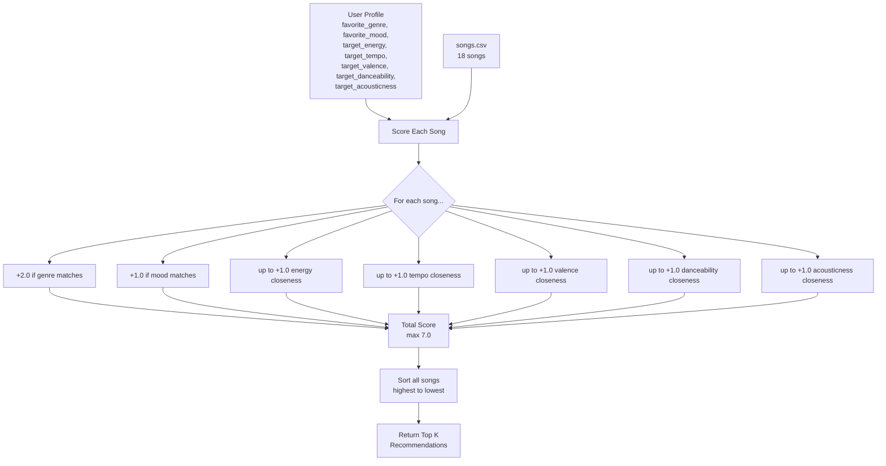
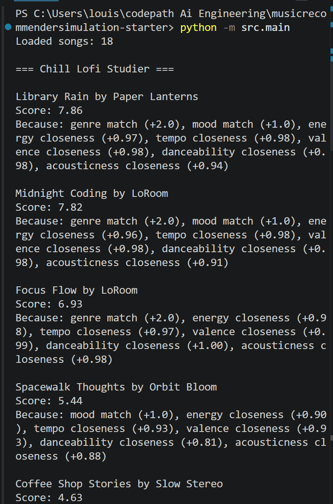
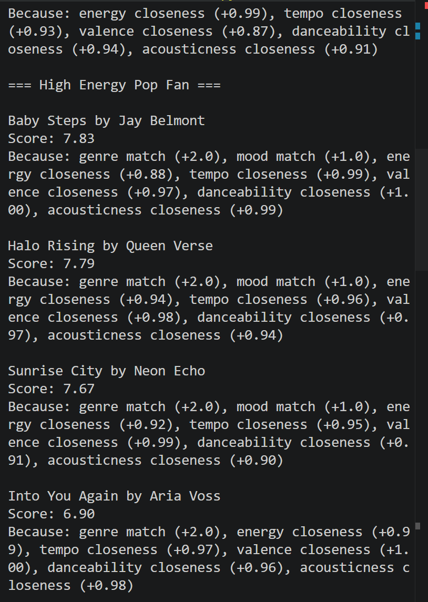
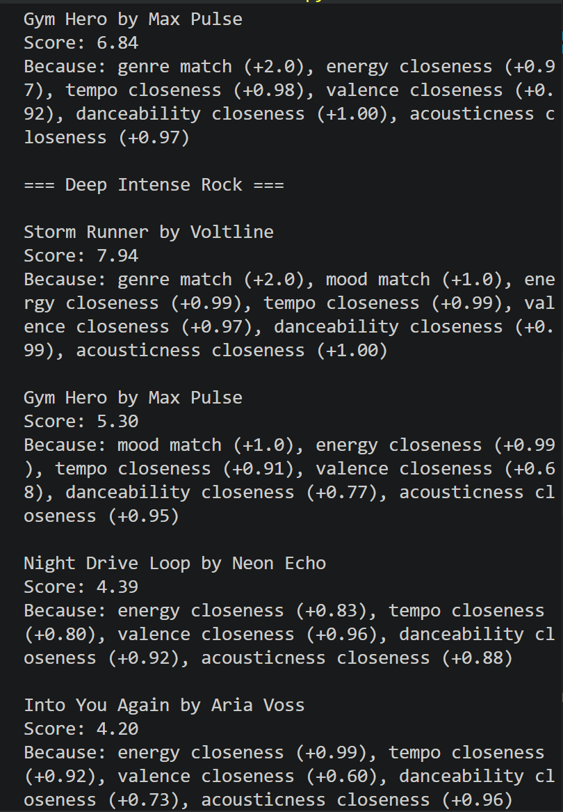
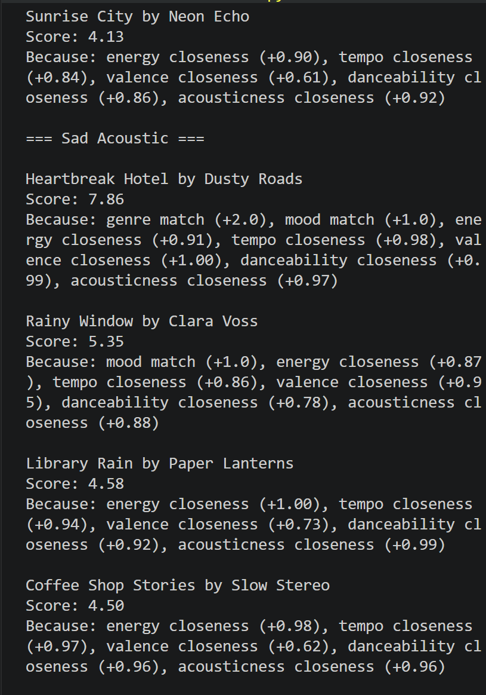
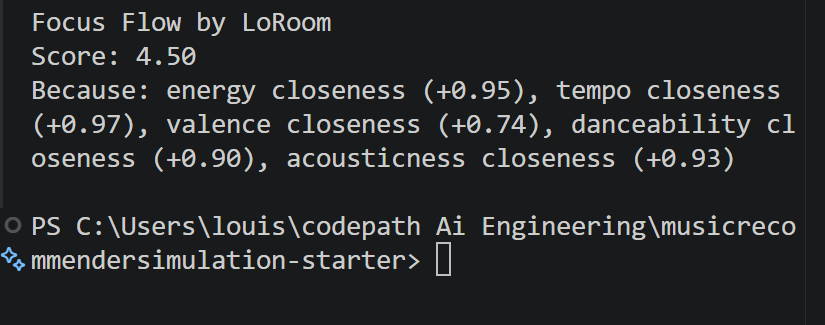
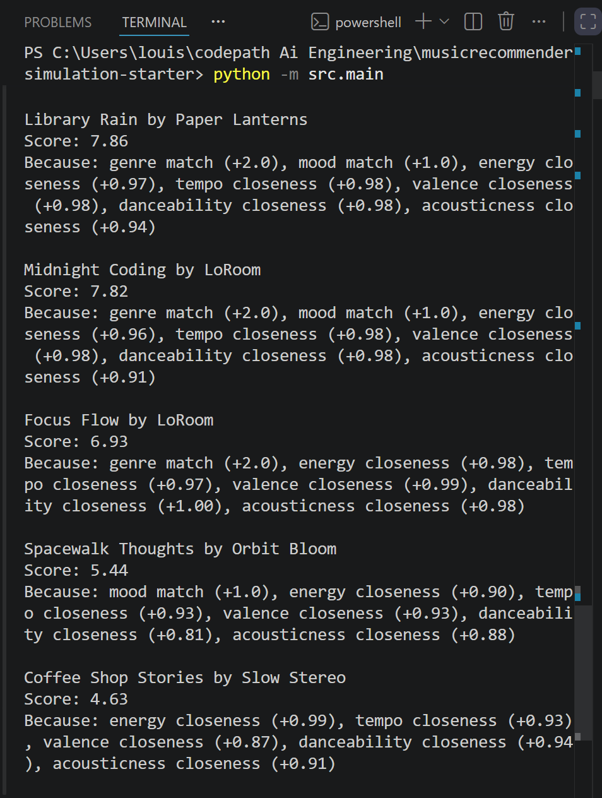

# 🎵 Music Recommender Simulation

## Project Summary

This simulation builds a content-based music recommender in Python that scores songs from a small catalog against a user's taste profile. It awards points for matching genre and mood, and uses a proximity formula to reward songs whose numerical features (energy, tempo, valence, danceability, acousticness) are closest to the user's targets. The top K songs by total score are returned as personalized recommendations.
---

## How The System Works


Real-world platforms like Spotify use a mix of collaborative filtering (recommending based on what similar users liked) and content-based filtering (recommending based on a song's own attributes like genre, mood, and energy). This simulation focuses purely on content-based filtering -- it compares song attributes directly to a user's stated preferences, with no behavioral data involved.


Algorthm Recipe: 
Each song is scored by comparing its attributes to the user's target profile. Genre match awards +2.0 points and mood match awards +1.0 because categorical matches are the strongest signal of taste. The five numerical features (energy, tempo, valence, danceability, acousticness) each contribute up to +1.0 using a proximity formula that rewards closeness to the user's target value. The maximum possible score is 7.0. Songs are then sorted from highest to lowest score and the top K results are returned.




Expected bias: this system will strongly favor lofi songs for the default profile because genre is worth more than any single numerical feature. A great match on all five numerical features (5.0 points) still loses to any song that matches genre and mood (3.0 points plus some numerical score).


Song features: genre, mood, energy, tempo_bpm, valence, danceability, acousticness

User profile stores: favorite_genre favorite_mood, target_energy,  target_tempo_bpm, target_valence, target_danceability, target_acousticness

Scoring weights: genre match (+2.0), mood match (+1.0), energy closeness (up to +1.0)

---

## Getting Started

### Setup

1. Create a virtual environment (optional but recommended):

   ```bash
   python -m venv .venv
   source .venv/bin/activate      # Mac or Linux
   .venv\Scripts\activate         # Windows

2. Install dependencies

```bash
pip install -r requirements.txt
```

3. Run the app:

```bash
python -m src.main
```

### Running Tests

Run the starter tests with:

```bash
pytest
```

You can add more tests in `tests/test_recommender.py`.

---

## Experiments You Tried

Experiment 1 -- Four diverse profiles
The lofi and pop profiles returned strong varied results because those genres have more songs in the catalog. The rock and blues profiles showed a sharp drop after the first result, revealing that underrepresented genres get weaker recommendations overall.










```
Loaded songs: 18

Top recommendations:

Library Rain by Paper Lanterns
Score: 7.86
Because: genre match (+2.0), mood match (+1.0), energy closeness (+0.97)...

Midnight Coding by LoRoom
Score: 7.82
...
```


Experiment 2 -- Accuracy check
For the High Energy Pop Fan profile, Baby Steps ranked above Sunrise City despite Sunrise City feeling like the more intuitive match. The algorithm favored Baby Steps because its danceability and tempo were numerically closer to the target. This shows that content-based filtering can produce technically correct but musically unintuitive results.

Experiment 3 -- Weight shift (energy x2, genre halved)
Doubling energy and halving genre changed individual rankings within profiles but did not change which songs dominated overall. Genre match is still the strongest single signal even at +1.0 because no other feature can compensate for a genre mismatch across the whole catalog.


---

## Limitations and Risks

The catalog is small (18 songs), so results will feel repetitive across different profiles
Genre carries the most weight, which means a great mood and energy match can still lose to a mediocre genre match

The system has no memory -- it treats every session as if the user is brand new
It cannot understand lyrics, language, or cultural context

The dataset skews toward pop and lofi, so users with other tastes will get fewer strong matches

---

## Reflection

Building this recommender showed me that prediction is really just structured comparison. The system does not actually understand music. It just measures distance between numbers and hands out points. What surprised me most was how persistent genre bias was even after I reduced its weight in the experiment. That helped me understand why real platforms can feel repetitive. When a system is trained to match categories, it keeps pulling users back to the same type of music.
Using AI tools throughout this project was useful for generating code and explaining tradeoffs, but I had to stay alert. The tools occasionally gave me code that looked right but had subtle issues like duplicate functions in my recommender file. The moments where I caught those errors were the moments I actually understood what the code was doing.
If I extended this project I would focus on two things. First I would add more songs per underrepresented genre so the catalog is more balanced. Second I would build a diversity feature so the top results always include songs from more than one genre even when one genre dominates the score.

---


## 1. Model Name

Give your recommender a name, for example:

> VibeFinder 1.0

---

## 2. Intended Use

This system suggests songs from a small catalog based on a user's preferred genre,
mood, and numerical taste targets like energy and tempo. It is designed for classroom
exploration only, not for real users or production use. It assumes the user has a
single fixed taste profile and knows exactly what genre and mood they want.


## 3. How It Works (Short Explanation)

The system compares each song in the catalog to a user's taste profile and gives it
a score. A genre match adds the most points because genre is the strongest signal of
overall taste. A mood match adds slightly fewer points. For numerical features like
energy, tempo, valence, danceability, and acousticness, the system rewards songs that
are closest to the user's target value rather than just high or low. Once every song
has a score, the system sorts them from highest to lowest and returns the top results.
Think of it like a judge scoring contestants. Each song gets rated on how well it
matches what the user asked for, and the best matches rise to the top.

---

## 4. Data


The catalog contains 18 songs across genres including lofi, pop, rock, jazz, ambient,
synthwave, indie pop, r&b, country, classical, blues, and folk. Moods represented
include happy, chill, intense, relaxed, focused, moody, euphoric, and sad. The
original starter dataset had 10 songs, mostly lofi and pop. Eight songs were added to
improve genre and mood diversity. Pop and lofi still have more songs than other genres,
which affects recommendation quality for underrepresented tastes.

---

## 5. Strengths

The system works best for users who prefer lofi or pop because those genres have the
most songs in the catalog, giving the recommender more options to differentiate
between. The scoring logic is fully transparent. Every recommendation comes with a
breakdown of exactly why each song was chosen. The proximity formula for numerical
features is also a strength because it rewards close matches rather than just extreme
values, which makes recommendations feel more tuned to the user.

---

## 6. Limitations and Bias

The system has a strong genre bias because genre match is worth +2.0 points, more than any single numerical feature. This means a song that perfectly matches the user's energy, tempo, valence, danceability, and acousticness can still lose to a mediocre song that simply shares the same genre label.
The catalog is too small and unevenly distributed. Pop and lofi have multiple songs each, so users who prefer those genres get more varied and accurate recommendations. Users who prefer rock, blues, or classical only have one song each in the catalog, so their results drop off sharply after the first recommendation.
This creates a filter bubble effect where users are consistently shown the same small pool of songs from their preferred genre and rarely discover music from other genres that might actually match their vibe numerically.
The system also treats all users as having the same preference shape. It assumes everyone wants an exact match on genre and mood. A user who wants to discover new genres, or who has mixed taste, would be poorly served by this design.

---

## 7. Evaluation

I tested the system with four distinct user profiles: Chill Lofi Studier, High Energy Pop Fan, Deep Intense Rock, and Sad Acoustic. For each profile I observed the top 5 results and compared them to what felt musically intuitive.
The lofi and pop profiles produced the most varied and satisfying results because those genres had more songs in the catalog. The rock and blues profiles exposed a clear weakness -- after the first result, scores dropped sharply because there was only one song per genre, forcing the system to recommend numerically close songs from completely different genres.
I also ran a weight experiment where I doubled the energy score and halved the genre score. The rankings shifted slightly within profiles but the overall dominance of genre matching remained, showing that even at half weight, genre is still the strongest signal in the system.
The biggest surprise was that Baby Steps by Jay Belmont ranked above Sunrise City for the High Energy Pop Fan profile despite Sunrise City feeling like the more intuitive match. This showed that technically correct scores don't always produce musically satisfying results.

---

## 8. Future Work

Add more songs per genre to reduce the drop off problem for underrepresented tastes.
Implement a diversity penalty that prevents too many songs from the same genre
appearing in the top results. Add support for mixed taste profiles where a user can
specify interest in multiple genres with different weights. Replace exact genre
matching with a similarity score so adjacent genres like synthwave and electronic can
still earn partial points.

---

## 9. Personal Reflection

Building this recommender showed me that prediction is really just structured comparison. The system does not actually understand music. It just measures distance between numbers and hands out points. What surprised me most was how persistent genre bias was even after I reduced its weight in the experiment. That helped me understand why real platforms can feel repetitive. When a system is trained to match categories, it keeps pulling users back to the same type of music.
Using AI tools throughout this project was useful for generating code and explaining tradeoffs, but I had to stay alert. The tools occasionally gave me code that looked right but had subtle issues like duplicate functions in my recommender file. The moments where I caught those errors were the moments I actually understood what the code was doing.
If I extended this project I would focus on two things. First I would add more songs per underrepresented genre so the catalog is more balanced. Second I would build a diversity feature so the top results always include songs from more than one genre even when one genre dominates the score.


